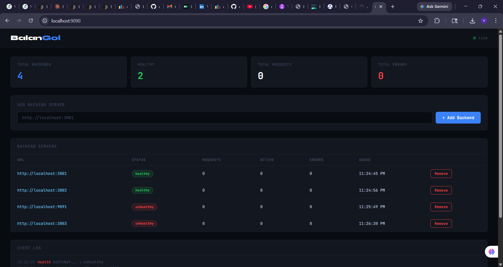

# BalanGOl — Go Load Balancer

A production-style HTTP load balancer built in Go with Round Robin algorithm, real-time health checks, REST API for managing backends, and a live dashboard.

## Architecture

```
                    ┌─────────────────────────────────┐
  Clients ─────────▶│  Load Balancer  :8080           │
                    │  (reverse proxy + round robin)  │
                    └────────────┬────────────────────┘
                                 │ forwards to healthy backend
                    ┌────────────▼──────────────────────┐
                    │  Backend 1   Backend 2   Backend N│
                    └───────────────────────────────────┘

                    ┌─────────────────────────────────┐
  Browser ─────────▶│  Admin API + Dashboard  :9090   │
                    │  REST API + WebSocket            │
                    └─────────────────────────────────┘
```

## Features
- **Round Robin** load balancing across N backend servers
- **Health checks** every 10 seconds — unhealthy backends are skipped automatically
- **REST API** to add/remove backends at runtime (no restart needed)
- **WebSocket dashboard** — live status, request counts, health updates
- **Atomic counters** for per-backend request/error tracking
- **Interface-driven** balancer — swap RoundRobin for LeastConnections easily

## Project Structure
```
loadbalancer/
├── cmd/server/main.go              # Entry point — two HTTP servers
├── internal/
│   ├── models/backend.go           # Backend model with atomic counters
│   ├── balancer/
│   │   ├── balancer.go             # Balancer interface + Registry
│   │   └── roundrobin.go           # Round Robin algorithm
│   ├── proxy/proxy.go              # httputil.ReverseProxy wrapper
│   ├── health/checker.go           # Goroutine-based health checker
│   └── server/
│       ├── api.go                  # REST API handlers
│       ├── hub.go                  # WebSocket broadcast hub
│       └── ws.go                   # WebSocket upgrade handler
└── web/index.html                  # Live dashboard
```

## Quick Start

```bash
go mod tidy
go run ./cmd/server
```

Two servers start:
- `:8080` — the actual load balancer (send your traffic here)
- `:9090` — admin dashboard (open in browser)

## API

### Add a backend
```bash
curl -X POST http://localhost:9090/api/backends \
  -H "Content-Type: application/json" \
  -d '{"url": "http://localhost:3001"}'
```

### List backends
```bash
curl http://localhost:9090/api/backends
```

### Remove a backend
```bash
curl -X DELETE http://localhost:9090/api/backends/{id}
```

### Stats
```bash
curl http://localhost:9090/api/stats
```

## Testing with dummy backends

Start a few simple servers in separate terminals:
```bash
# Terminal 1
python3 -m http.server 3001

# Terminal 2
python3 -m http.server 3002

# Terminal 3
python3 -m http.server 3003
```


Then add them via the dashboard or API and watch requests get distributed.

## Go Concepts Demonstrated

| Concept | Where |
|---|---|
| `httputil.ReverseProxy` | `proxy/proxy.go` — core forwarding |
| Goroutines | health checker, WebSocket pumps, hub |
| `sync/atomic` | per-backend request/error counters |
| `sync.RWMutex` | backend registry, round robin list |
| Interfaces | `Balancer` interface — swappable algorithms |
| Channels | WebSocket hub fan-out |
| `http.ServeMux` | Go 1.22 method+path routing |


